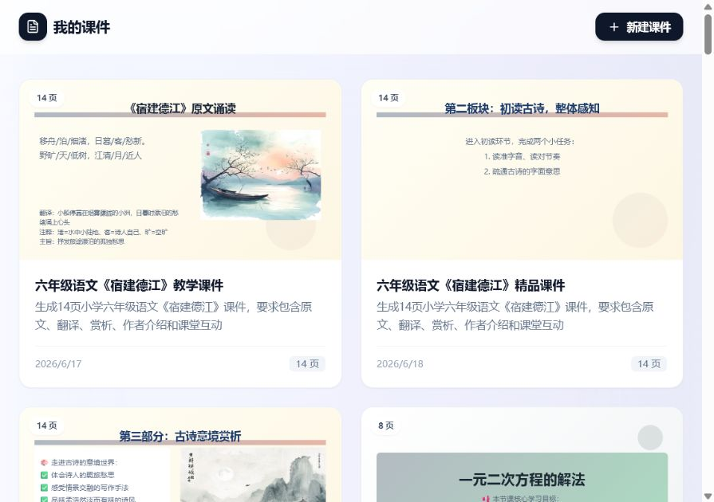
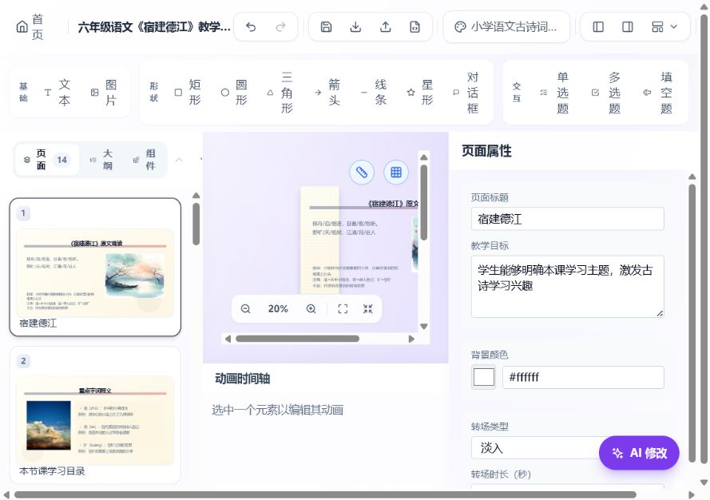
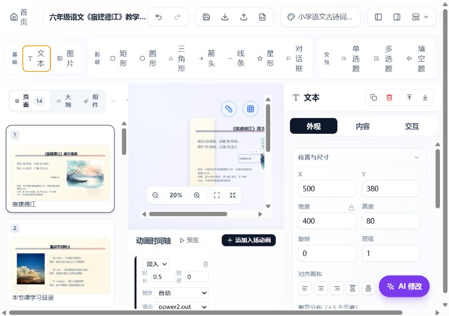
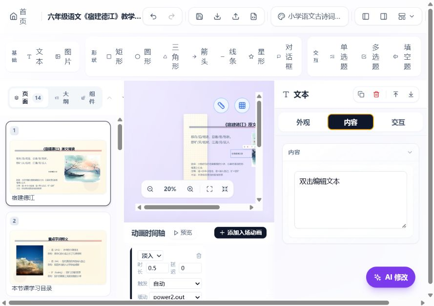
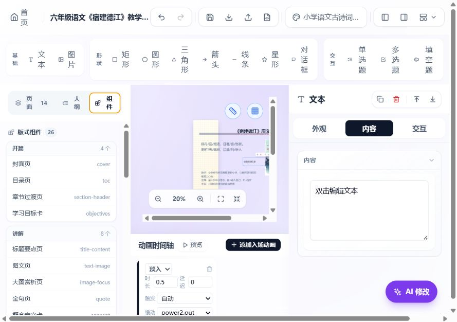
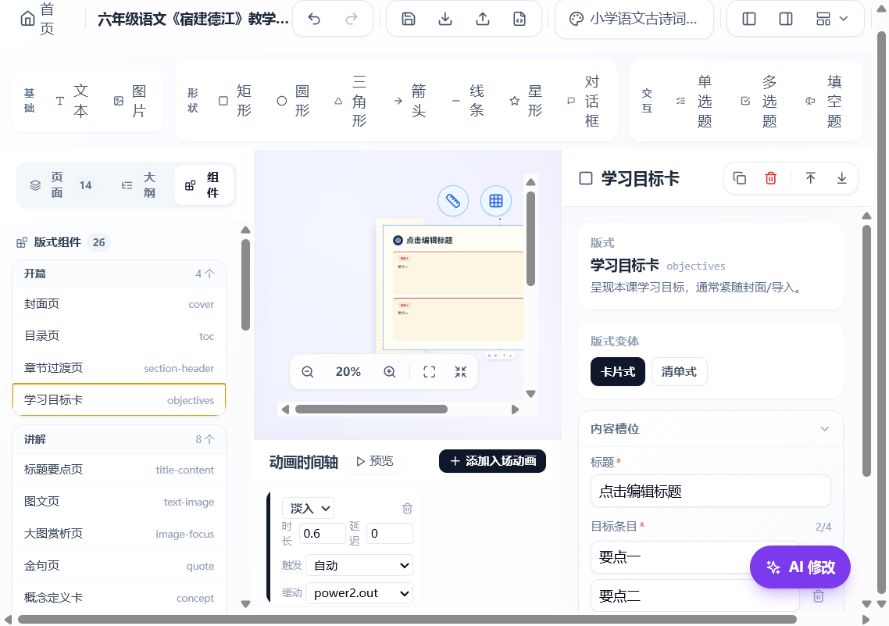
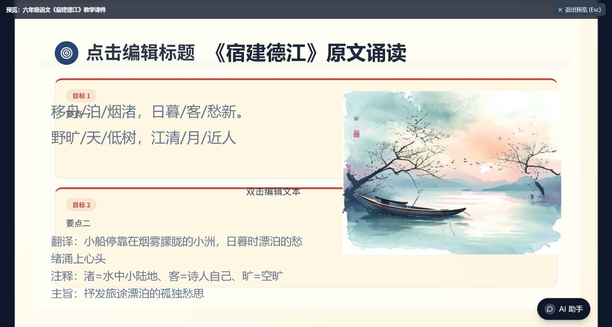
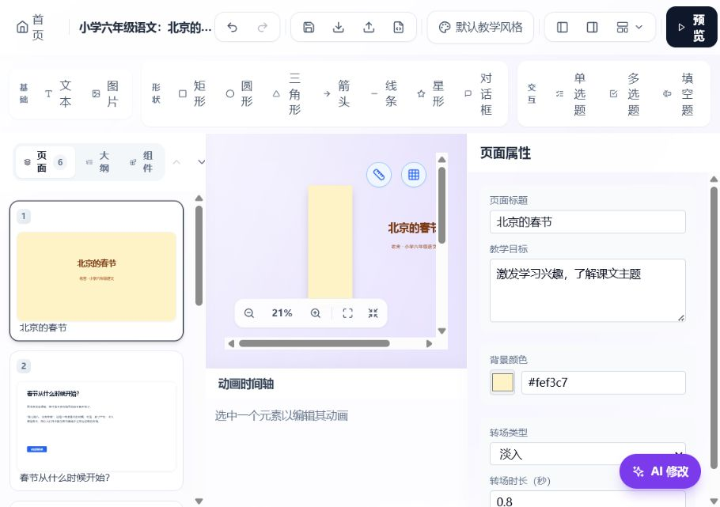

# HTML 课件编辑器深度评估

日期：2026-07-30

## 结论

方向是对的，但当前产品更接近“AI 课件生成器 + 播放器 + 编辑器原型”，还不是可以放心承载真实备课工作的编辑器。

项目已经具备一批很有价值的底层能力：统一课件 Schema、播放器与编辑器共用渲染、自由画布、结构化 Block、互动组件、动画、撤销重做、HTML 导出。这些都应该保留。

接下来不应继续优先扩充更多模板、动画和 AI 花样。最重要的是先把“课件文档”做成可靠的产品对象，并明确采用“结构化编辑为主、自由画布为辅”的编辑模型。

## 审查范围

核心任务：从课件列表打开已有课件，添加并编辑内容，插入结构化组件，预览，然后刷新并继续工作。

代码范围：

- 前端路由、课件列表、编辑器、画布、属性面板、组件面板、历史记录、导出
- 后端课件、素材、SQLite 持久化接口
- 共享 Courseware / Slide / Element Schema

验证结果：

- TypeScript 类型检查通过
- 生产构建通过
- 浏览器无业务运行错误，仅有 React Router 升级提示
- 前端构建存在较大的主包和 Mermaid 相关包警告

## 流程证据

### 1. 课件列表：可浏览，但还不是文档工作台

优点：

- 卡片缩略图能快速识别课件。
- 新建入口明确。

主要问题：

- 没有搜索、排序、筛选、文件夹、收藏、复制或重命名。
- 编辑、预览、删除只在悬停后显示，发现性和触屏可用性较弱。
- 列表接口直接返回 35 个完整课件、279 页、2.14 MB 数据；数据增长后会明显变慢。
- 默认顺序不是“最近编辑”。

### 2. 编辑器全貌：功能很多，但画布不是主角

优点：

- 页面、画布、属性、动画均在同一工作台中。
- 有撤销、导入导出、主题和预览入口。

主要问题：

- 当前窗口中画布只能缩放到约 20%，内容无法直接阅读和精修。
- 顶部同时展示文件、视图、主题、基础元素、形状和题型，优先级过于平均。
- 左侧页面、底部动画、右侧属性长期占用空间；应按任务渐进展开。
- 工具栏在窄宽度下文字竖排并产生整页横向滚动。

### 3. 自由元素属性：基础能力完整，但编辑路径过重

优点：

- 支持位置、尺寸、旋转、层级、对齐、字体、边框、阴影等。
- 画布已有拖拽、缩放、旋转、网格和智能参考线。

主要问题：

- 常用内容修改与高级几何参数处在同一密度层级。
- 很多输入框在可访问结构中没有明确名称，缩略图和画布元素也主要依赖鼠标。
- 新增文本后默认进入“外观”而不是“内容”，与用户意图不一致。
- 属性输入每次变化都会创建历史快照，长文本编辑会迅速耗尽 50 步历史。

### 4. 文本内容：能改，但缺少真正的文本编辑体验

主要问题：

- 目前更像一个 textarea，而不是课件文本编辑器。
- 缺少段落、项目符号、局部样式、链接、粘贴清理、自动适配和溢出提示。
- 内容修改与画布内双击编辑是两套路径，缺少明确的主路径。

### 5. 组件库：这是正确方向

优点：

- 26 个教学版式和 7 个课堂互动组件按教学用途分类。
- “封面、目标、讲解、学科、互动、收尾”的组织方式比纯图形工具更符合教师心智。

需要改进：

- 展示英文内部类型名会增加噪声。
- 没有预览缩略图、搜索、最近使用和学科筛选。
- 当前插入逻辑只重排已有 Block，不处理自由元素。

### 6. 结构化 Block：应成为默认编辑模式

优点：

- 标题、列表、变体等槽位可以直接编辑。
- 数据与呈现分离，有利于 AI 修改、主题切换、响应式布局和可靠导出。

主要问题：

- 表格、步骤、配对、时间线、测验、古诗等复杂槽位仍退回 JSON 编辑，普通教师无法使用。
- “在画布中双击可进入自由编辑”会把结构化组件重新变成自由元素，编辑语义不够稳定。
- 缺少内容校验、字数建议、溢出警告和一键换版式时的字段映射预览。

### 7. 预览：播放器基础不错，但暴露了两套布局冲突

优点：

- 编辑器与播放器复用渲染，预览速度快。
- 课堂 AI 助手和互动能力已经接入。

主要问题：

- 新插入的学习目标 Block 与原有自由元素重叠，标题、正文和图片互相遮挡。
- 组件面板的重排算法只识别 Block，无法保证混合页面的布局安全。
- 编辑器未在进入预览前提示溢出、遮挡或越界。

### 8. 刷新：当前最大的产品阻断

打开《宿建德江》后直接刷新 `/editor`，编辑器切换成了内置示例《北京的春节》，未保存修改也全部消失。

原因：

- 编辑路由没有课件 ID，只有 `/editor`。
- 课件列表把完整对象塞进内存 Store 后跳转。
- Store 默认值是内置示例课件。
- 编辑器不根据 URL 重新加载课件，也没有自动保存、草稿恢复或离开提醒。

这意味着用户不能收藏编辑链接、刷新页面、在新标签打开、恢复崩溃现场，也无法信任保存状态。

## 关键工程问题

### P0：文档身份和生命周期

- 使用 `/courseware/:id/edit` 与 `/courseware/:id/present`。
- 编辑页按 ID 加载，提供加载、无权限、已删除和错误状态。
- 新建时先创建草稿并取得 ID，再进入编辑器。
- 增加 `revision` 或 ETag，避免后写覆盖前写。
- 自动保存使用短延迟合并，并显示“保存中 / 已保存 / 保存失败 / 离线草稿”。
- 关闭或跳转前保护未保存修改；本地草稿可存 IndexedDB。
- 历史记录应按课件隔离；进入新课件时清空或恢复对应历史。

### P0：统一编辑模型

建议采用：

1. 默认“结构化页面”：页面由有顺序的 Block 组成，负责自动布局和内容编辑。
2. 可选“自由画布层”：用于标注、装饰、临时补充，不参与 Block 重排。
3. 显式“转换为自由布局”，并提示转换后失去自动重排能力。

不要让 Block 和普通绝对定位元素在同一层中互相不知道对方存在。

### P0：素材工作流

后端已有上传接口，但编辑器没有素材上传和素材库，图片属性只能填写“资源 ID”。

需要：

- 从本地上传、粘贴、拖入、从现有素材选择和替换图片。
- 裁剪、焦点、适应方式、Alt 文本、压缩与尺寸提示。
- 素材元数据持久化、引用计数和安全删除。
- 导入包中的 Blob 素材在保存前上传或转成持久资源，不能把临时 `blob:` URL 写进数据库。

### P1：撤销和保存事务

- 历史记录当前全局共享，首次进入编辑器就记录一个快照，撤销可能先“无变化”，甚至跨课件。
- 属性输入应按一次编辑会话合并历史，而不是每个字符一条。
- 拖拽、批量修改、AI 修改和结构转换应形成明确事务。
- AI 修改应先展示差异和影响范围，再确认应用；完整替换整个 Slide 风险较高。

### P1：把复杂槽位做成人类可用的编辑器

按使用频率优先实现：

- 表格：行列增删、单元格编辑、表头和样式。
- 测验：题干、选项、正确答案、解析和重试规则。
- 步骤 / 时间线：卡片式增删和排序。
- 图文：上传、替换、裁剪、Alt 文本。
- 对比 / 配对 / 分类：左右项目编辑和拖拽排序。

JSON 编辑只保留在“高级 / 调试”区域。

### P1：导出可靠性

- `JSON.stringify(...).replace(/</g, '<')` 是无效转义，课件文本中的 `</script>` 可能破坏导出 HTML。
- 素材内联失败时当前会保留外部 URL，和“离线可用”承诺不一致，应显示失败清单并阻止或允许用户确认继续。
- 独立播放器需要手动执行单独构建脚本，根构建不会确保导出模板与当前播放器同步。
- 应建立“同一课件在编辑器、预览和导出 HTML 的截图一致性”回归测试。

### P2：列表、性能和工程质量

- 课件列表使用摘要接口，只返回 ID、标题、更新时间、页数和封面缩略图。
- 增加分页、搜索、最近编辑排序、复制、重命名和归档。
- 按路由拆包，延迟加载 Mermaid、KaTeX 和编辑器高级面板。
- 把现有脚本整理成可重复的自动化测试：文档打开/刷新、保存恢复、撤销事务、素材导入、Block 编辑、预览和 HTML 导出。

## 推荐实施顺序

### 第一阶段：先做到“不丢稿”

目标：用户能通过固定链接打开课件，刷新不丢内容，修改会自动保存，失败时能恢复。

交付：ID 路由、按 ID 加载、草稿创建、自动保存状态、修订号、离开保护、历史隔离、列表摘要接口。

### 第二阶段：让结构化编辑成为主路径

目标：教师不需要理解坐标、层级和 JSON，也能完成 80% 的课件修改。

交付：Block-first 页面、自由层隔离、可靠重排、复杂槽位表单、素材库、图片替换、溢出与遮挡检测。

### 第三阶段：完成真实备课闭环

目标：从生成到精修、课堂预览、再次打开和离线导出都稳定一致。

交付：讲稿与来源引用、批量查找替换、跨页主题调整、AI 差异预览、无障碍与键盘操作、导出一致性测试。

## 可用编辑器的验收标准

一名教师应能在不接触 JSON 和资源 ID 的情况下：

1. 从列表打开一个明确的课件 URL。
2. 刷新、关闭、重新打开后继续原位置工作。
3. 编辑文本、列表、表格、图片和测验。
4. 添加、移动、复制、删除和换版式，并能可靠撤销。
5. 上传和替换素材。
6. 在保存失败时看到原因并恢复本地草稿。
7. 预览前看到遮挡、溢出和资源缺失提示。
8. 导出一个与预览一致、真正离线可用的 HTML。

